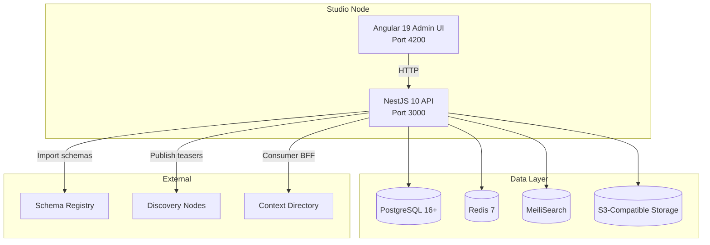
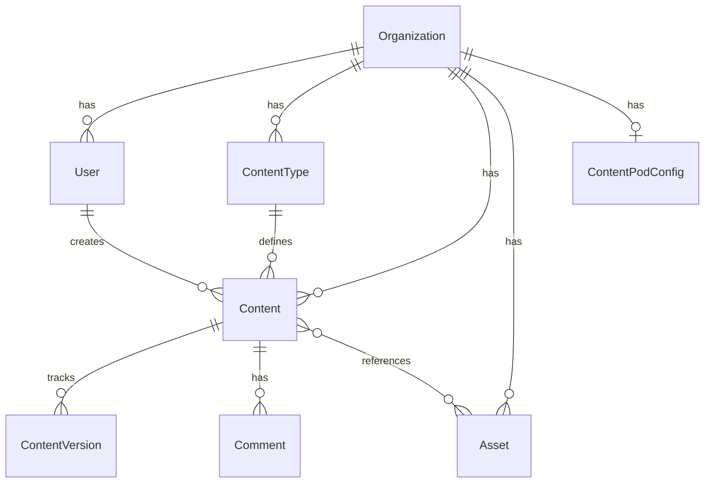

## System Overview

roadbeat Studio is a monorepo containing a **NestJS backend API** and an **Angular frontend**, backed by PostgreSQL, Redis, and MeiliSearch.



## Technology Stack

| Layer | Technology | Purpose |
|-------|-----------|---------|
| **Backend** | NestJS 10, TypeScript | Modular API framework |
| **ORM** | Prisma 6 | Type-safe database access, migrations |
| **Database** | PostgreSQL 16+ | Primary data store (28+ models) |
| **Cache** | Redis 7 (ioredis) | Sessions, caching, job queues |
| **Search** | MeiliSearch | Full-text search across content, assets, users |
| **Queue** | BullMQ | Webhook delivery, publishing retries, async jobs |
| **Auth** | JWT (passport-jwt), bcrypt | Authentication and password hashing |
| **Crypto** | Ed25519 (Node.js built-in) | Teaser signing for Discovery Nodes |
| **Logging** | Pino | Structured JSON logging with request correlation |
| **Frontend** | Angular 19 | Standalone components, signals |
| **Styling** | Tailwind CSS 4 | Utility-first CSS framework |
| **Rich Text** | TipTap / ProseMirror | WYSIWYG content editing |
| **Packaging** | Docker Compose | 6-service deployment stack |

## Backend Modules

The API is organized into 30+ NestJS modules, each responsible for a specific domain:

<Tabs>
  <Tab title="Core" icon="server">
    | Module | Path | Description |
    |--------|------|-------------|
    | **Auth** | `auth/` | JWT login, setup wizard, refresh, password management, multi-org email resolution |
    | **Users** | `users/` | User CRUD with per-org limits |
    | **Organizations** | `organizations/` | Organization settings and configuration |
    | **Platform** | `platform/` | Super admin: org CRUD, platform stats, admin management |
    | **Database** | `database/` | Prisma client, connection management |
    | **Redis** | `redis/` | Cache service with org-scoped key namespacing |
    | **Queue** | `queue/` | BullMQ job processing for async tasks |
    | **Config** | `config/` | Environment configuration with Joi validation |
  </Tab>
  <Tab title="Content" icon="edit">
    | Module | Path | Description |
    |--------|------|-------------|
    | **ContentTypes** | `content-types/` | JSON Schema-based content type definitions |
    | **Content** | `content/` | Content CRUD, versioning, publish/unpublish (Global) |
    | **ContentRelations** | `content-relations/` | References, hierarchy, tree navigation |
    | **Comments** | `comments/` | Threaded comments on content |
    | **Search** | `search/` | MeiliSearch full-text search integration |
    | **Layouts** | `layouts/` | Content presentation layouts |
    | **Locales** | `locales/` | Locale CRUD, translation tasks, variants, RTL |
  </Tab>
  <Tab title="Assets" icon="image">
    | Module | Path | Description |
    |--------|------|-------------|
    | **Assets** | `assets/` | File upload, metadata extraction, folders, tags, search, usage tracking |
    | **CDN** | `cdn/` | CDN URL generation, signing, responsive images, edge caching |
  </Tab>
  <Tab title="Publishing" icon="send">
    | Module | Path | Description |
    |--------|------|-------------|
    | **Publishing** | `publishing/` | Ed25519 signing, teaser generation, DN distribution |
    | **ContentPod** | `content-pod/` | Pod config CRUD, publish/unpublish to pod, quota enforcement, setup service |
    | **DiscoveryNodes** | `discovery-nodes/` | Publishing target management |
    | **Delivery** | `delivery/` | Public read-only API (API key auth) |
    | **SchemaRegistry** | `schema-registry/` | Import content types from Schema Registry |
    | **Export** | `export/` | Backup/restore and content pod export |
  </Tab>
  <Tab title="Infrastructure" icon="settings">
    | Module | Path | Description |
    |--------|------|-------------|
    | **Webhooks** | `webhooks/` | Outbound webhooks with HMAC signing |
    | **ApiKeys** | `api-keys/` | API key management with scoped permissions |
    | **Dashboard** | `dashboard/` | Aggregated statistics |
    | **Health** | `health/` | Health checks (DB, Redis, MeiliSearch, queues) |
    | **License** | `license/` | Ed25519 license validation |
    | **Plugin** | `plugins/` | Plugin loader, manifest serving, asset controller |
  </Tab>
</Tabs>

## Frontend Architecture

The Angular 19 frontend uses **standalone components** and **signal-based** state management throughout.

### Route Structure

| Route | Feature | Auth |
|-------|---------|------|
| `/auth/*` | Login, setup wizard, forgot/reset password | Public |
| `/dashboard` | Stats cards, recent content, breakdown | JWT |
| `/content/*` | Content list, editor with dynamic forms | JWT |
| `/content-types/*` | Content type builder, Schema Registry import | JWT |
| `/assets/*` | Asset library with folders, upload, detail panel | JWT |
| `/users/*` | User management with roles | JWT (admin) |
| `/settings/*` | Organization config, webhooks, API keys | JWT (admin) |
| `/consumer/*` | Consumer discovery features from `@roadbeat/consumer` | JWT |
| `/platform/*` | Platform admin: org management, stats, super admin | JWT (super admin) |
| `/pro/*` | Pro plugin routes loaded dynamically | JWT |

### Key Frontend Services

- **ApiService** — Typed HTTP client wrapping Angular `HttpClient`
- **AuthService** — JWT token management, login/logout, auth state
- **ContentService** — Content CRUD operations
- **ContentTypeService** — Content type management and Schema Registry import
- **AssetsService** — Asset operations and upload
- **SearchService** — Global search integration (Ctrl+K command palette)
- **PluginService** — Dynamic plugin loading and manifest management

## Plugin System

Pro features are loaded as plugins at runtime. The CE defines extension points; plugins register additional NestJS modules and Angular web components.

```mermaid
graph LR
    CE[Studio CE] -->|exports| SDK[@roadbeat/plugin-sdk]
    SDK -->|imports| P1[pro-workflows]
    SDK -->|imports| P2[pro-audit]
    SDK -->|imports| P3[pro-scheduling]
    CE -->|loads at runtime| P1
    CE -->|loads at runtime| P2
    CE -->|loads at runtime| P3
```

- Plugins are discovered from the `PLUGINS_DIR` directory
- Each plugin has a `manifest.json` and an entry point implementing `RoadbeatPlugin`
- License validation is offline via Ed25519 signed JWT tokens
- Plugin frontend bundles are served as web components via `@angular/elements`

See [Plugin System](/plugins/overview) for details.

## Data Model

The core Prisma schema contains 28+ models. Key entities:



## Event System

Studio uses `@nestjs/event-emitter` for lifecycle events. Pro plugins listen to these events to extend functionality without modifying CE code.

| Event Category | Events |
|---------------|--------|
| **Content** | `beforeCreate`, `afterCreate`, `beforeUpdate`, `afterUpdate`, `beforeDelete`, `afterDelete`, `beforePublish`, `afterPublish`, `beforeUnpublish`, `afterUnpublish` |
| **Asset** | `afterUpload`, `beforeDelete`, `afterDelete`, `afterProcess` |
| **User** | `afterLogin`, `afterLogout`, `afterCreate`, `afterUpdate`, `afterDelete` |
| **Publishing** | `beforeTeaserGenerate`, `afterTeaserGenerate`, `beforeDiscoveryPush`, `afterDiscoveryPush` |

"Before" events are **preventable** — plugins can block actions by calling `event.prevent()`.
