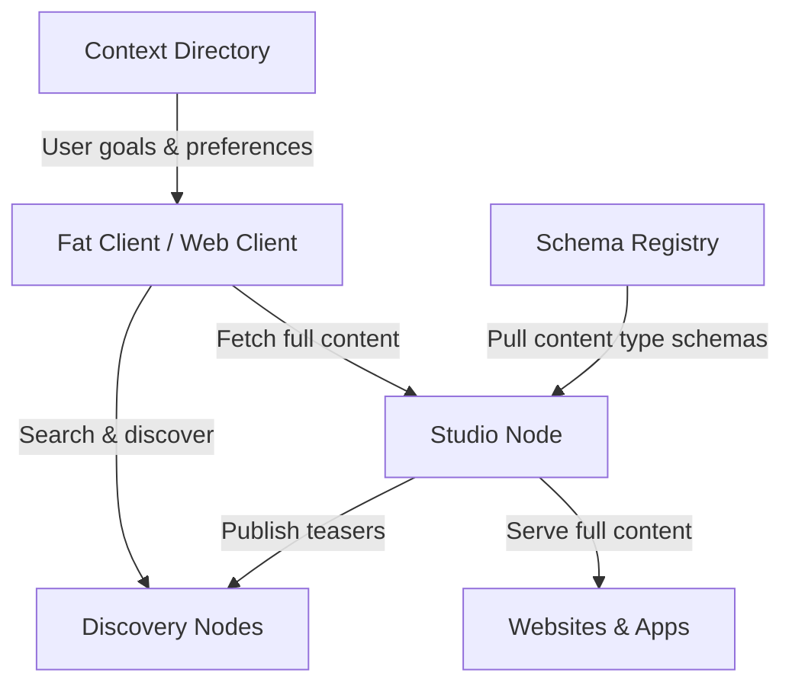
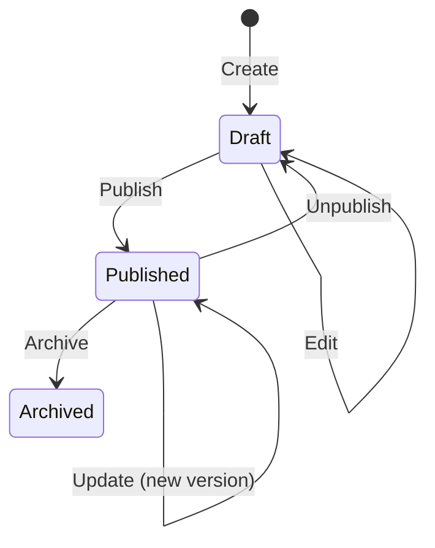

## The roadbeat Ecosystem

roadbeat Studio is one component in a larger decentralized content platform. Understanding how these pieces connect helps you get the most out of Studio.

## Content Types

A **content type** defines the structure of a piece of content. Instead of generic "posts", roadbeat uses precise types like News, Events, Job Offers, Recipes, or Real Estate Listings — each with its own rich metadata schema.

Content types are defined as **JSON Schemas** and can be:

- **Imported** from the central [Schema Registry](/guides/content-types#importing-from-the-schema-registry) with one click
- **Created manually** using the visual [Content Type Builder](/guides/content-types#content-type-builder)

Each content type includes three schemas:

| Schema | Purpose |
|--------|---------|
| **Metadata Schema** | Core definition — fields, types, validation rules |
| **Form Schema** | Layout definition — tabs, sections, field ordering, UI hints |
| **Teaser Schema** | Subset of fields sent to Discovery Nodes for search and preview |

## Content Lifecycle

Every content item follows a defined lifecycle:

| Status | Description | API Visible |
|--------|-------------|-------------|
| **Draft** | Work in progress, editable | No |
| **Published** | Live content, served via Delivery API | Yes |
| **Archived** | Historical record, read-only | No |

<Callout kind="tip">
  With Pro plugins, additional workflow stages like **In Review**, **Approved**, and **Scheduled** become available.
</Callout>

## Versioning

Every save creates a new **version** of the content. You can view the version history, compare changes, and restore any previous version.

- **CE** retains up to 10 versions per content item
- **Pro** has unlimited version retention

## Assets

Assets are media files (images, videos, documents) managed in the **Asset Library**. Assets are:

- Uploaded with automatic metadata extraction (EXIF, dimensions)
- Organized in **folders**
- Tagged and searchable
- Tracked for usage across content items

## Publishing

Publishing in roadbeat Studio means two things:

1. **Setting status to published** — makes content available via the Delivery API
2. **Distributing to Discovery Nodes** — pushes a signed teaser to the search network

The publishing pipeline:

<Steps>
  <Step title="Validate" icon="check-circle">
    Schema validation, required fields check, reference integrity.
  </Step>
  <Step title="Generate Teaser" icon="file-text">
    Extract teaser fields from the full content using the teaser schema.
  </Step>
  <Step title="Sign" icon="key">
    Sign the teaser with the publisher's Ed25519 private key.
  </Step>
  <Step title="Distribute" icon="send">
    Push the signed teaser to all configured Discovery Nodes.
  </Step>
</Steps>

## APIs

Studio provides two distinct APIs:

<Tabs>
  <Tab title="Management API" icon="settings">
    Authenticated with **JWT tokens**. Used by the admin UI and internal tools.

    - Full CRUD for content, assets, users, content types
    - Publishing actions
    - Organization settings

    Base path: `/api/v1/manage/...`
  </Tab>
  <Tab title="Delivery API" icon="globe">
    Authenticated with **API keys**. Used by websites, mobile apps, and third-party consumers.

    - Read-only access to published content
    - Content type schemas
    - Asset metadata

    Base path: `/api/v1/delivery/...`
  </Tab>
</Tabs>

## Organizations & Multi-Tenancy

Studio is **multi-tenant** — multiple organizations share a single database and application instance, but all data is strictly isolated per organization. Every query includes an `organizationId` filter, ensuring zero data leakage between tenants.

Each organization has its own:

- **Content and content types** (content types use a composite primary key `(organization_id, id)`)
- **Users and roles**
- **Assets** (stored under org-specific directory paths)
- **Webhooks, API keys, and settings**
- **Search indexes** (org-scoped filtering and reindexing)
- **Rate limits** (per-org throttling)

<Callout kind="tip">
  See the [Multi-Tenancy guide](/guides/multi-tenancy) for full architecture details, platform administration, and data isolation mechanisms.
</Callout>

## Roles

CE provides three organization-level roles plus a cross-org platform role:

| Role | Scope | Permissions |
|------|-------|------------|
| **Super Admin** | Platform-wide | Create/manage organizations, view platform stats, grant/revoke super admin |
| **Admin** | Organization | Full access — users, settings, content, publishing, search reindex |
| **Editor** | Organization | Create, edit, publish content and manage assets |
| **Viewer** | Organization | Read-only access to content and assets |

<Callout kind="info">
  Pro plugins like `pro-advanced-roles` add granular per-content-type permissions and custom roles.
</Callout>