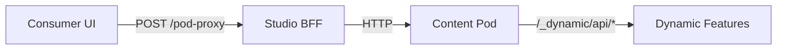

## Overview

roadbeat Studio includes a built-in **consumer experience** — a set of content discovery features that let Studio users explore content from the broader roadbeat network. These features are powered by the `@roadbeat/consumer` Angular library and backed by 14 NestJS backend-for-frontend (BFF) modules.

The consumer features appear in the **DISCOVER** section of the Studio sidebar, above the content management area.

<Callout kind="info">
  The same `@roadbeat/consumer` library is shared between Studio and the standalone Web Client. In Studio, it's mounted at `/consumer/*`; in the Web Client, it's the primary experience.
</Callout>

## Features

<Columns cols={2}>
  <Card title="Compass" icon="compass" href="#compass">
    Goal portfolio management with categories, templates, time horizons, and progress tracking.
  </Card>
  <Card title="Discover" icon="search" href="#discover">
    Federated search across Discovery Nodes with facets, goal tabs, calendar view, and transparency drawer.
  </Card>
  <Card title="Publishers" icon="users" href="#publishers">
    Searchable publisher directory with trust badges, profiles, and follow system.
  </Card>
  <Card title="Bookmarks" icon="bookmark" href="#bookmarks">
    Save and organize content into collections with drag-to-reorder and optimistic updates.
  </Card>
  <Card title="Notifications" icon="bell" href="#notifications">
    Notification center with filtering, preferences, and 5-minute polling.
  </Card>
  <Card title="Content Detail" icon="file-text" href="#content-detail">
    Rich teaser views for 6+ content types with type-specific sections.
  </Card>
</Columns>

## Context Directory Integration

Consumer features require a **Context Directory** account. Studio automatically provisions a CD account for each user on first access to any consumer feature.

The account linking is managed via:

```bash
# Check CD account link status
GET /api/v1/consumer/account/status

# Manually trigger CD account linking
POST /api/v1/consumer/account/link

# Remove CD account link
DELETE /api/v1/consumer/account/link
```

Configure the Context Directory URL in `.env`:

```bash
CONTEXT_DIRECTORY_URL=http://localhost:3100
```

## Compass

The **Compass** is the goal management center. Users define personal goals across time horizons, and the system matches content to those goals.

### Goal Management

```bash
# Get user's goal portfolio
GET /api/v1/consumer/goals

# Create a single goal
POST /api/v1/consumer/goals
{ "templateId": "...", "categoryId": "...", "subcategoryId": "...",
  "name": "...", "parameters": {}, "timeHorizon": "year" }

# Create multiple goals at once
POST /api/v1/consumer/goals/bulk
{ "goals": [{ "templateId": "...", "name": "...", "timeHorizon": "month", ... }] }

# Update a goal
PATCH /api/v1/consumer/goals/:goalId
{ "name": "...", "timeHorizon": "year" }

# Delete a goal
DELETE /api/v1/consumer/goals/:goalId
```

### Goal Browsing & Search

```bash
# Get goal tree categories (e.g., personal, business)
GET /api/v1/consumer/goals/categories

# Get categories with subcategories for a goal tree
GET /api/v1/consumer/goals/trees/:treeId/categories

# Get individual goals for a subcategory
GET /api/v1/consumer/goals/subcategories/:subcategoryId

# Search goals (MeiliSearch-powered)
GET /api/v1/consumer/goals/search?q=mentor&treeId=personal
```

### Goal Structure

Goals are organized hierarchically:

- **Goal Tree** — e.g., Personal, Business, Publisher, Private Group
- **Category** — e.g., Career & Professional, Learning & Knowledge
- **Subcategory** — e.g., Career Networking, Language Learning
- **Goal** — e.g., "Find mentors in {{field}}" with typed parameters
- **Time Horizon** — Life, Year, Month, Week, Day

### Compass Views

The Compass page adapts its layout based on the selected time horizon filter:

- **"All" selected** — displays category cards in a grid (e.g., "Business & Organisation Goals", "Personal Goals"), each showing goal count and description. Click a card to drill into that category.
- **Specific horizon selected** (Life, Year, Month, Week, Day) — switches to a flat goal list grouped by category name. Each group shows a category heading followed by goal cards with parameters and horizon badges. Only categories with matching goals are shown.

### Goal Reordering

Goals can be reordered via **drag-and-drop** (Angular CDK). Users grab a goal card and drag it to a new position within the list. The new sort order is persisted automatically via the API.

The time horizon filter is also available inside the **category detail view** — when viewing a single category's goals, the same horizon tabs appear above the goal list, and the goal count in the header updates to reflect the filtered results.

<Callout kind="info">
  Time horizons are stored in both abbreviated (`l`, `y`, `m`, `w`, `d`) and full (`life`, `year`, `month`, `week`, `day`) forms. The UI normalizes both formats automatically, so filtering works regardless of how the horizon was originally saved.
</Callout>

### Goal Editor Wizard

The goal editor is a 4-step wizard:

1. **Select goal tree** — choose a category (Personal, Business, etc.)
2. **Browse & multi-select** — expandable tree or search with checkbox multi-selection
3. **Customize goals** — scrollable list of selected goals with inline parameter inputs (text fields, searchable dropdowns) and per-goal time horizon selection
4. **Confirm** — review goals with the ability to remove individual goals before saving

Goals with parameterized text templates (e.g., `"Visit national parks in {{country}}"`) render inline input fields within the sentence. Parameters may include suggestions or options for searchable dropdowns. Time horizon is intelligently preselected from the goal's `time_context` metadata when a single value exists.

#### Editing Existing Goals

When editing an existing goal, the editor opens directly at step 3. For goals with parameters, the **standardized goal text** is reconstructed with inline variable inputs pre-filled with the current parameter values — the same UI as the add flow. The full resolved title is shown as an editable text field below the template line. Changing a variable automatically updates the full title. Custom goals (without parameters) show only the title input.

## Discover

The **Discover** page provides federated search across all configured Discovery Nodes.

### Search API

```bash
# Federated search
POST /api/v1/consumer/discover/search
{
  "query": "climate policy",
  "contentType": "news",
  "filters": { "location.country": "DE" },
  "page": 1,
  "pageSize": 20
}

# Goal-based search
POST /api/v1/consumer/discover/by-goal
{ "goalId": "goal-uuid" }

# Autocomplete suggestions
GET /api/v1/consumer/discover/suggestions?q=clim

# Available Discovery Nodes and their status
GET /api/v1/consumer/discover/nodes

# Facet configuration for a content type
GET /api/v1/consumer/discover/facets/:contentType
```

### Frontend Features

- **Facet sidebar** — dynamic filters (checkboxes, date ranges, geo distance, toggles)
- **Goal group tabs** — two-level tab navigation: the first row shows goal categories (e.g., "Business & Organisation Goals", "Personal Goals") plus an "All Goals" tab; selecting a category reveals a second row of individual goal tabs within that category. Tab order follows the user's Compass sort order. Selecting a goal tab triggers a goal-based search.
- **View modes** — 8 modes organized in grouped toggle: Activity Feed (social-media timeline with big images), Compact List, Large List (detailed rows with larger thumbnails), Compact Tiles (4 per row), Large Tiles (3 per row with more info), Calendar, Map (interactive Leaflet/OpenStreetMap with marker clustering), 3D Globe (interactive Mapbox globe with custom markers)
- **Sort controls** — by relevance, date, or other fields
- **"Why am I seeing this?"** — transparency drawer explaining content matching and goal relevance
- **Active filter pills** — dismissible badges showing current filters

### Map View

The **Map** view mode renders content with geographic coordinates on an interactive map using [Leaflet](https://leafletjs.com/) with OpenStreetMap tiles.

- **Marker clustering** — nearby markers are grouped into cluster badges that show the count and expand on zoom or click. Cluster sizes: small (blue, &lt;10), medium (amber, 10–99), large (red, 100+).
- **Custom icon markers** — each content type is represented by a 36px white circle marker with a color-coded border and a Lucide SVG icon inside (e.g., calendar for events, briefcase for jobs, pen for blog posts). Colors are grouped by content type category (blue for news/publications, purple for events, green for jobs, orange for food, etc.).
- **Popup cards** — clicking a marker opens a vertical popup card matching the teaser grid card design: full-width hero image, content type badge with inline Lucide icon, publisher name, title (2-line clamp), description (2-line clamp), and a footer with publication date and info/bookmark action buttons.
- **Popup interactions** — clicking the hero image, title, or description opens the content in the Content Reader (modal or 4K split pane). The "Why am I seeing this?" button opens the transparency drawer, and the Bookmark button opens the collection selector. All handlers use `stopPropagation` to prevent the map from intercepting clicks.
- **Facet sidebar** — the map renders inside the content area alongside the facet sidebar, so all filters (content type, language, topic, publisher, date) remain accessible.
- **Auto-fit bounds** — the map zooms to fit all visible markers with padding.
- **Reactive** — markers update dynamically when filters, goal tabs, or search queries change.

<Callout kind="info">
  Only teasers with `location.lat` and `location.lon` appear on the map. The badge in the top-right corner shows the count of geo-tagged items out of the total result set.
</Callout>

The backend extracts geographic coordinates from the Discovery Node response at `geographic.locations[0].coordinates` and maps them to the `TeaserDto.location` field with `lat`, `lon`, and `name`.

### 3D Globe

The **3D Globe** view mode renders geo-tagged content on an interactive 3D globe using [Mapbox GL JS](https://docs.mapbox.com/mapbox-gl-js/) with the `globe` projection.

- **Mapbox-powered globe** — full 3D globe with atmosphere, stars, fog, and smooth rotation using `mapbox://styles/mapbox/streets-v12` for a colorful base map.
- **Custom Lucide icon markers** — each content type has a distinct marker: 36px colored circular pin with a white background, content-type-specific border color, and a Lucide SVG icon (e.g., Calendar for events, Newspaper for news, Ticket for festivals, Briefcase for jobs, ChefHat for recipes, Home for real estate, GraduationCap for courses, Package for products). Markers scale up on hover with a smooth transition.
- **Popup cards** — clicking a marker opens a compact card popup with:
  - Hero image (120px) with rounded top corners and a close button overlay
  - Content type badge with inline Lucide icon and publisher name
  - Bold title and truncated description
  - Footer with publication date and info/bookmark action buttons
- **Popup interactions** — clicking the hero image or title opens the content in the Content Reader. The "Why am I seeing this?" and Bookmark buttons are fully wired. All click handlers run inside `ngZone.run()` to trigger Angular change detection from outside the zone (Mapbox runs outside Angular for performance), and use `stopPropagation` to prevent globe interaction.
- **Smart camera** — the globe automatically flies to the geographic center of all markers with an appropriate zoom level calculated from the coordinate span.
- **Optional spin** — globe auto-rotation is disabled by default but can be toggled on via the spin button. Rotation speed decreases at higher zoom levels and pauses during user interaction.
- **Navigation controls** — zoom and compass controls in the bottom-right corner.

<Callout kind="info">
  The 3D Globe requires a Mapbox access token. Configure it in your `.env` file:
  ```bash
  MAPBOX_TOKEN=pk.your_mapbox_token_here
  ```
  The token is served via a public endpoint (`GET /consumer/discover/mapbox-config`) so the frontend can initialize the map without authentication. If no token is configured, the globe view is automatically hidden from the view mode toggle.
</Callout>

#### Content Type Marker Colors

Both the 2D map and 3D globe use consistent color-coded circle markers with Lucide SVG icons. Colors are grouped by content type category:

| Category | Color | Example Icons |
|---|---|---|
| **News & Publications** | Blue (`#3b82f6`) | Newspaper, Megaphone, PenLine, FileText |
| **Events & Activities** | Purple (`#8b5cf6`) | Calendar, Target, Users, Monitor, Ticket |
| **Employment** | Green (`#22c55e`) | Briefcase, GraduationCap, Wrench, HeartHandshake |
| **Food & Dining** | Orange (`#f97316`) | ChefHat, Utensils |
| **People & Profiles** | Sky (`#0ea5e9`) | Building2, User, UserCheck |
| **Commerce & Listings** | Yellow (`#eab308`) | Package, ClipboardList, Gem |
| **Education & Learning** | Cyan (`#06b6d4`) | BookOpen, ListChecks, GraduationCap |
| **Media & Entertainment** | Pink (`#ec4899`) | Music, Mic, Camera, Palette |
| **Knowledge & Reference** | Indigo (`#6366f1`) | Microscope, FlaskConical, FolderKanban |
| **Default** | Indigo (`#6366f1`) | FileText |

### Calendar View

The **Calendar** view mode displays content on a month grid, organized by publication date. Each day cell shows a preview of scheduled events, news, jobs, and other date-based content.

#### Month View

- **6-row grid** — Monday-start weeks filling the full viewport height via `calc(100vh - offset)` with `grid-rows-6` for evenly distributed rows.
- **Dynamic teaser count** — a `ResizeObserver` measures actual cell height and calculates how many teasers fit per day. On 4K monitors, 5+ items may be visible; on smaller screens, 1–2.
- **Color-coded entries** — each content type has a distinct color: purple for events, blue for news, green for jobs, amber for courses.
- **"+N more" drill-down** — when a day has more teasers than the cell can display, a clickable "+N more" link switches to the **week view** for that day's week.
- **Month navigation** — previous/next month arrows with a header showing the current month and year.

#### Week View

Clicking "+N more" on any day opens a week view for that Monday–Sunday range:

- **Full event list** — all teasers for each day are shown (no truncation), with publisher names displayed below each title.
- **Taller cells** — each day column fills the remaining viewport height with a scrollable teaser list.
- **Event count** — a small badge in each day header shows the number of events.
- **Today highlight** — the current day gets a ring highlight for quick orientation.
- **Week navigation** — previous/next week arrows; the header shows the date range (e.g., "10 Mar – 16 Mar 2026").
- **Back to month** — a "Month" button in the header returns to the monthly grid.

<Callout kind="tip">
  The week view is especially useful for days with many events — like conference weeks or festival periods — where the month view's limited cell height would hide most content behind "+N more".
</Callout>

### Transparency Drawer

The **"Why am I seeing this?"** drawer is a slide-over panel that explains why a specific piece of content was recommended. It opens when the user taps the info icon on any content card.

The drawer displays:

- **Teaser summary** — title, content type, publisher, and thumbnail
- **Goal match indicator** — a dynamic status box:
  - 🟢 **Goal match** (green) — when one or more user goals matched the content
  - 🔵 **Content match** (blue) — when content was found via search criteria without a specific goal match, or when the user has no goals set up
- **Relevance score** — visual progress bar showing the search relevance percentage
- **Matched goals** — list of user goals that relate to this content, displayed as green badges with checkmark icons, showing goal name and category. If no goals matched, an informative message is shown instead:
  - *"No specific goal matched this content"* — when the user has goals but none overlap
  - *"No goals set up yet"* — when the user hasn't created any goals on the Compass page
- **Matching criteria** — badges showing content classification tags (e.g., "technology", "environment")
- **Adjust your results** — action links:
  - **Edit your goals** — navigates to the Compass page (`/consumer/compass`)
  - **Adjust location settings** — navigates to Profile Settings (`/consumer/profile/settings`)
  - **Hide content from this publisher** — publisher-level content filtering

#### Goal Matching Logic

The drawer determines matched goals using a three-tier strategy:

<Steps>
  <Step title="Direct match">
    If the content was found via a **goal-based search** (`POST /discover/by-goal`), the teaser carries the originating `goalId`. This provides a guaranteed match.
  </Step>
  <Step title="Active goal tab">
    If the user has a **goal tab selected** in the Discover view, that goal is used as the match context.
  </Step>
  <Step title="Fuzzy matching">
    As a fallback, the system compares the content's **badges and content type** against the user's goal names and categories using partial substring matching. For example, a teaser with the badge "technology" would match a goal named "Follow developments in technology".
  </Step>
</Steps>

<Callout kind="tip">
  Setting up goals on the Compass page significantly improves the transparency drawer experience — it enables the system to show exactly which goals led to each content recommendation.
</Callout>

## Publishers

Browse and follow publishers across the roadbeat network.

```bash
# Search publishers
GET /api/v1/consumer/publishers?q=news&filter=verified&page=1&limit=20

# Get publisher detail
GET /api/v1/consumer/publishers/:id

# Get publisher's content
GET /api/v1/consumer/publishers/:id/content
```

### Following

```bash
# Get followed publishers
GET /api/v1/consumer/follows

# Follow a publisher
POST /api/v1/consumer/follows/:publisherId

# Unfollow a publisher
DELETE /api/v1/consumer/follows/:publisherId

# Sync full follow list
PUT /api/v1/consumer/follows
{ "publisherIds": ["id-1", "id-2"] }
```

### Trust Badges

Publishers have 4 trust levels displayed as colored badges:

| Level | Badge | Meaning |
|-------|-------|---------|
| **Unverified** | Gray | No verification |
| **Domain** | Blue | Domain ownership verified |
| **Organization** | Green | Organization identity verified |
| **Trusted** | Gold | Full editorial verification |

## Bookmarks

Save content and organize into collections.

```bash
# Get bookmarks (paginated, filterable)
GET /api/v1/consumer/bookmarks?collection=uuid&sort=newest&page=1

# Add bookmark
POST /api/v1/consumer/bookmarks
{ "teaserId": "teaser-uuid" }

# Remove bookmark
DELETE /api/v1/consumer/bookmarks/:teaserId

# Check if bookmarked
GET /api/v1/consumer/bookmarks/:teaserId/status
```

### Collections

```bash
# List collections with item counts
GET /api/v1/consumer/bookmarks/collections

# Create collection
POST /api/v1/consumer/bookmarks/collections
{ "name": "Research" }

# Update collection
PUT /api/v1/consumer/bookmarks/collections/:id
{ "name": "Climate Research" }

# Delete collection
DELETE /api/v1/consumer/bookmarks/collections/:id

# Add item to collection
POST /api/v1/consumer/bookmarks/collections/:id/items
{ "teaserId": "teaser-uuid" }

# Remove item from collection
DELETE /api/v1/consumer/bookmarks/collections/:id/items/:teaserId
```

## Notifications

```bash
# Get notifications (paginated, filterable by type)
GET /api/v1/consumer/notifications?type=content&page=1

# Get unread count
GET /api/v1/consumer/notifications/unread-count

# Mark as read
PUT /api/v1/consumer/notifications/:id/read

# Mark all as read
PUT /api/v1/consumer/notifications/read-all

# Get/update notification preferences
GET /api/v1/consumer/notifications/preferences
PUT /api/v1/consumer/notifications/preferences
```

## Content Reader

The **Content Reader** provides an integrated inline reading experience for content from Content Pods, replacing the previous behavior of opening external URLs in new tabs.

### Display Modes

| Mode | Context | Behavior |
|------|---------|----------|
| **Split pane** | 4K / ultrawide (≥2560px) | Side-by-side: left 50% Discover list, right 50% reader pane |
| **Modal overlay** | Regular desktop, tablet, mobile | Full-screen modal with focus trap, Escape to close, backdrop dismiss |
| **External tab** | Self-hosted content (`isExternal`) | Opens in new browser tab with external-link badge on cards |

### Content Reader Features

- **Hero image** with alt text, resolved against the pod base URL
- **Article body** rendered as sanitized HTML with relative asset URLs rewritten to absolute pod URLs
- **Publisher metadata** — name, publication date, reading time, word count
- **Content signature badge** — Verified (green), Signature invalid (red), or Unverified (gray)
- **Categories, tags, and language badges**
- **Image gallery** with resolved thumbnails and captions
- **Loading skeleton** — realistic full-layout skeleton matching the content structure
- **Error states** — 4 context-specific screens: pod unreachable, content not found, signature invalid, and generic error — each with Retry and Close actions

### Content Sources

The Content Reader supports three content source types, determined by the canonical URL of each teaser:

| Source | Detection | Behavior |
|--------|-----------|----------|
| **Studio** | Canonical URL matches `CANONICAL_URL_BASE` or `localhost` | Fetches published content directly from the Studio database via Prisma |
| **Pod** | Canonical URL matches configured pod domain patterns | Fetches content from the Content Pod's `index.json` endpoint |
| **External** | No pattern match | Opens in a new browser tab (not in the reader) |

<Callout kind="tip">
  Set the `CANONICAL_URL_BASE` environment variable to your Studio's public URL (e.g., `http://localhost:3000` in development) so that published content is recognized as a Studio source and displayed directly in the Content Reader without needing a deployed Content Pod.
</Callout>

When the source is **Studio**, the backend transforms database records into the `PodContentItemDto` format, mapping headline, description, article body, media (hero image, gallery), classification (categories, tags), dates, publisher info, and metadata (reading time, word count).

### Content Reader API

```bash
# Fetch full content for the reader
GET /api/v1/consumer/discover/content/:contentType/:slug

# Proxy dynamic pod interactions
POST /api/v1/consumer/discover/pod-proxy
{
  "podBaseUrl": "https://pod.example.com",
  "endpoint": "/_dynamic/api/reactions.php",
  "method": "GET",
  "params": { "content_id": "c_001" }
}
```

### Modal Accessibility

The content reader modal includes:

- **ARIA dialog** attributes (`role="dialog"`, `aria-modal="true"`)
- **Focus trap** — Tab cycling within the modal
- **Focus restoration** — returns focus to the previously focused element on close
- **Keyboard support** — Escape to close
- **Reduced motion** — animations disabled when `prefers-reduced-motion` is set

## Dynamic Pod Features

When content is loaded from a **dynamic Content Pod** (one that has `_roadbeat/config.json` with enabled features), the Content Reader displays interactive sections below the article body.

<Callout kind="info">
  Dynamic sections are **capability-driven** — they only appear when the pod's configuration explicitly enables them. The pod capabilities are probed automatically when content is loaded.
</Callout>

### Reactions

Emoji reaction buttons (👍❤️🔥👏🤔) displayed below the article. Users can toggle reactions with optimistic UI updates. Pods can specify custom reaction types via their configuration.

### Comments

Threaded comment display with:

- Recursive rendering up to a configurable `maxDepth` (default: 3)
- Comment submission form with name, email, and content fields
- Reply-to threading with visual indentation
- Loading skeletons during fetch
- Empty state with call-to-action

### Newsletter

Inline subscription form that appears when the pod advertises newsletter capability:

- Email input with validation
- Loading spinner during submission
- Success confirmation message
- Publisher name personalization in the header

### Pod-Proxy Architecture

All dynamic pod interactions are proxied through the Studio BFF to avoid CORS issues and provide a consistent API surface:



The BFF endpoint accepts the pod base URL, target endpoint, HTTP method, and parameters, then forwards the request to the pod's dynamic API.

## Tip System

The **Tip System** lets users compensate content creators through a budget-based tipping mechanism. Tips are tracked locally in `localStorage` and represent appreciation for quality content.

### How It Works

<Steps>
  <Step title="Content loads in reader" icon="book-open">
    When content finishes loading, the auto-tip countdown starts (if enabled).
  </Step>
  <Step title="Countdown runs" icon="clock">
    A configurable timer (default 30s) counts down in the footer. The user can manually tip at any time by selecting a multiplier and clicking confirm.
  </Step>
  <Step title="Tip recorded" icon="check-circle">
    When the countdown reaches zero (or the user clicks confirm), the tip is recorded to localStorage with the teaser ID, publisher, multiplier, and timestamp.
  </Step>
  <Step title="Budget tracked" icon="wallet">
    Monthly spending is computed from tip history. The budget progress bar updates in real-time, and tips are blocked when the monthly budget is exhausted.
  </Step>
</Steps>

### Tip Multiplier

The footer displays a **1x–5x multiplier selector** with pill buttons. The selected multiplier determines how many budget units are consumed per tip.

### Budget Configuration

Users configure their tip budget in **Discover Settings → Tip Budget**:

| Setting | Range | Default | Description |
|---------|-------|---------|-------------|
| **Monthly budget** | 10–500 | 100 | Maximum tip units per month |
| **Auto-tip** | on/off | on | Enable automatic tipping after reading |
| **Auto-tip delay** | 10–120s | 30s | Seconds of reading before auto-tip fires |
| **Auto-tip multiplier** | 1x–5x | 1x | Default multiplier for automatic tips |

### Tip Stats

The settings page displays:

- **Spent this month** — total tip units consumed in the current calendar month
- **Total tips given** — lifetime tip count
- **Budget progress bar** — green (>50%), yellow (20–50%), red (&lt;20%)

<Callout kind="tip">
  Tip data is stored in `localStorage` under `rb_tip_history` (last 500 records) and `rb_tip_budget` (configuration). Future versions will sync tip data to the Context Directory for cross-device persistence.
</Callout>

## Content Detail

Rich teaser detail views with content-type-specific sections:

```bash
# Get teaser detail
GET /api/v1/consumer/discover/teaser/:contentType/:slug

# Get related content
POST /api/v1/consumer/discover/related
{ "contentType": "news", "categories": ["politics"], "tags": ["climate"] }
```

Content-type-specific sections include:

| Content Type | Special Fields |
|-------------|---------------|
| **News** | Publication date, source, reading time |
| **Events** | Date/time, venue, ticket price, registration |
| **Jobs** | Company, salary, employment type, deadline |
| **Recipes** | Prep/cook time, servings, difficulty |
| **Real Estate** | Price, rooms, area, address |
| **Courses** | Duration, skill level, format |

## Mobile Sync

Sync user data to mobile apps:

```bash
# Generate sync package
GET /api/v1/consumer/sync/package

# Create single-use sync token
POST /api/v1/consumer/sync/token

# Get package by token (public endpoint)
GET /api/v1/consumer/sync/token/:token

# Get QR code data for mobile deep link
GET /api/v1/consumer/sync/qr
```

## Discover Settings

The **Discover Settings** page (`/consumer/settings`) is a unified settings experience that combines profile management and consumer preferences into a single page with 7 card sections.

<Callout kind="info">
  Studio users have two identities: a **Studio account** (CMS admin login) and a **Discover profile** (identity on the roadbeat network). The Discover profile is automatically linked to the Studio account via the Context Directory. Users manage their Discover profile and preferences on this page, while Studio-level settings (organization, API keys, etc.) remain under System → Settings.
</Callout>

### Settings Sections

| Section | Description |
|---------|-------------|
| **Discover Profile** | Display name (editable), email (read-only, managed by Studio account), CD link status |
| **Language & Region** | Preferred locale (24 EU languages), country (ISO 3166-1), region |
| **Privacy** | Toggles for goal sync, follows sync, bookmarks sync, location sharing, analytics consent |
| **Notifications** | Goal digest frequency (daily/weekly/off), publisher updates, bookmark reminders, system announcements, browser push |
| **Content Preferences** | Enable/disable content types in Discover feed (news, events, jobs, courses, recipes, real estate, press releases) |
| **Tip Budget** | Monthly budget slider (10–500), auto-tip toggle, delay slider (10–120s), auto-tip multiplier (1x–5x), spending stats, clear history |
| **Discovery Nodes** | Select which Discovery Nodes to query, with online/offline status badges |
| **Security** | Change password (current + new + confirm) |

### Profile API

The profile endpoint returns Studio user data as the primary source, enriched with Context Directory data when available:

```bash
# Get user profile (composite: Studio + CD)
GET /api/v1/consumer/user

# Update profile
PUT /api/v1/consumer/user

# Change password
PUT /api/v1/consumer/user/password
```

### Notification Preferences API

```bash
# Get notification preferences (auto-creates defaults on first access)
GET /api/v1/consumer/notifications/preferences

# Update notification preferences
PUT /api/v1/consumer/notifications/preferences

# Get unread notification count
GET /api/v1/consumer/notifications/unread-count
```

### GDPR & Data

```bash
# GDPR data export
POST /api/v1/consumer/user/export
GET /api/v1/consumer/user/export/:token

# Account deletion (30-day grace period)
POST /api/v1/consumer/user/delete
POST /api/v1/consumer/user/delete/cancel
```

### Database Schema

Consumer notifications are stored in the Studio database (not the Context Directory):

- **`notifications`** — `id`, `user_id` (FK → users), `type`, `title`, `body`, `data` (JSONB), `action_url`, `is_read`, `created_at`
- **`notification_preferences`** — `id`, `user_id` (unique, FK → users), `goal_digest_frequency` (default: weekly), `publisher_updates`, `bookmark_reminders`, `system_announcements`, `browser_push`

## Shared Services

The `@roadbeat/consumer` library provides shared services used across all features:

| Service | Description |
|---------|-------------|
| **ThemeService** | Light/dark/system mode with `matchMedia` detection |
| **I18nService** | 24 EU locales with lazy-loaded JSON and `{{param}}` interpolation |
| **SeoService** | Dynamic meta/OG/Twitter Card tags, canonical URLs, JSON-LD |
| **FocusManagementService** | Route-change focus, scroll-to-top, ARIA live announcements |

## Consumer Health

```bash
GET /api/v1/consumer/health
GET /api/v1/consumer/health/ready
GET /api/v1/consumer/health/live
```