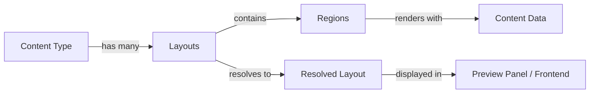

## Overview

Content Layouts define how content is visually presented on detail pages. Each layout is a JSON definition composed of **regions** — building blocks like hero images, titles, body text, metadata strips, and grids — that can be arranged, styled, and conditionally shown based on content data.

Layouts are managed per content type. Each content type can have multiple layouts with one marked as the default.

## How Layouts Work



<Steps>
  <Step title="Define a layout" icon="layout">
    A layout is a JSON definition with an array of regions, each specifying a type, data source (JSON path into content), and optional styles.
  </Step>
  <Step title="Resolve against content" icon="play">
    The **LayoutResolver** evaluates each region against the actual content data — resolving JSON paths, evaluating conditions, and merging responsive styles.
  </Step>
  <Step title="Render in preview" icon="monitor">
    The admin UI shows a **live preview panel** that updates as you edit content. Toggle between desktop, tablet, and mobile breakpoints.
  </Step>
</Steps>

## Region Types

Layouts support 30+ region types organized into categories:

<Tabs>
  <Tab title="Content Regions" icon="file-text">
    | Region Type | Description |
    |-------------|-------------|
    | `hero-image` | Full-width hero image with optional overlay |
    | `title` | Content title with configurable heading level |
    | `subtitle` | Subtitle or tagline |
    | `body-text` | Main body text / rich text content |
    | `metadata-strip` | Inline metadata (date, author, reading time) |
    | `tag-list` | Tags or categories as badges |
    | `image` | Inline image with caption |
    | `quote` | Blockquote with attribution |
    | `callout` | Highlighted information box |
    | `rating` | Star rating display |
    | `price` | Price display with currency |
    | `contact-info` | Contact details (email, phone, address) |
  </Tab>
  <Tab title="List Regions" icon="list">
    | Region Type | Description |
    |-------------|-------------|
    | `list-section` | Ordered or unordered list |
    | `key-value` | Key-value pairs (e.g., specifications) |
  </Tab>
  <Tab title="Layout Regions" icon="columns">
    | Region Type | Description |
    |-------------|-------------|
    | `row` | Horizontal flex container |
    | `column` | Vertical stack container |
    | `grid` | CSS grid container |
    | `card` | Card with border, shadow, padding |
    | `section` | Section with heading and content |
    | `sidebar-layout` | Main content + sidebar split |
    | `spacer` | Vertical spacing |
    | `divider` | Horizontal rule |
  </Tab>
</Tabs>

## Layout Definition Format

A layout definition is a JSON object:

```json
{
  "name": "News Default",
  "version": "1.0.0",
  "regions": [
    {
      "type": "hero-image",
      "source": "data.media.hero_image",
      "style": { "aspectRatio": "16/9" }
    },
    {
      "type": "title",
      "source": "data.headline",
      "style": { "fontSize": "2xl", "fontWeight": "bold" }
    },
    {
      "type": "metadata-strip",
      "source": "metadata",
      "style": { "gap": "md" }
    },
    {
      "type": "body-text",
      "source": "data.article_body"
    }
  ]
}
```

### Region Properties

| Property | Type | Description |
|----------|------|-------------|
| `type` | string | Region type (see tables above) |
| `source` | string | JSON path into the content data (dot notation, supports arrays) |
| `style` | object | Visual styling — font size, colors, spacing, alignment |
| `condition` | object | Show/hide based on content data (see Conditions) |
| `responsive` | object | Override styles per breakpoint (desktop/tablet/mobile) |
| `children` | array | Nested regions (for layout containers like row, column, grid) |

### Conditions

Regions can be conditionally shown or hidden based on content data:

```json
{
  "type": "price",
  "source": "data.pricing.amount",
  "condition": {
    "field": "data.access.is_free",
    "operator": "equals",
    "value": false
  }
}
```

| Operator | Description |
|----------|-------------|
| `exists` | Field has a value |
| `not_empty` | Field is not empty/null/undefined |
| `equals` | Field equals a specific value |
| `not_equals` | Field does not equal a specific value |
| `in` | Field value is in a list |
| `gt` | Field is greater than a value |
| `lt` | Field is less than a value |

### Responsive Styles

Override styles per breakpoint:

```json
{
  "type": "grid",
  "style": { "columns": 3, "gap": "lg" },
  "responsive": {
    "tablet": { "columns": 2 },
    "mobile": { "columns": 1, "gap": "md" }
  }
}
```

## Default Layouts

Studio includes bundled default layouts for common content types:

| Content Type | Layout | Description |
|-------------|--------|-------------|
| **News** | `news--default` | Hero image, headline, metadata strip, body, tags |
| **Event** | `event--default` | Hero, title, date/venue sidebar, description, map |
| **Cooking Recipe** | `cooking-recipe--default` | Hero, title, metadata, ingredients sidebar, steps |

Default layouts are seeded automatically when a content type is imported from the Schema Registry.

## Layout Management API

| Method | Endpoint | Description |
|--------|----------|-------------|
| `GET` | `/api/v1/manage/layouts` | List all layouts |
| `GET` | `/api/v1/manage/layouts/:id` | Get layout by ID |
| `GET` | `/api/v1/manage/layouts/content-type/:typeId` | List layouts for content type |
| `GET` | `/api/v1/manage/layouts/content-type/:typeId/default` | Get default layout |
| `PUT` | `/api/v1/manage/layouts/content-type/:typeId/default` | Set default layout |
| `POST` | `/api/v1/manage/layouts/content-type/:typeId/sync` | Sync layouts from Schema Registry |
| `POST` | `/api/v1/manage/layouts/validate` | Validate a layout definition |
| `POST` | `/api/v1/manage/layouts/:id/resolve` | Resolve layout against content data |

## Delivery API

Frontends can fetch layouts via the Delivery API:

```bash
# List layouts for a content type
GET /api/v1/delivery/layouts/:contentTypeId

# Get a specific layout definition
GET /api/v1/delivery/layouts/:contentTypeId/:layoutId
```

## Live Preview

The content editor includes a **Layout Preview Panel** that renders layouts in real-time:

- **Device toggle** — switch between desktop (≥1024px), tablet (768px), and mobile (375px)
- **Live updates** — preview updates as you type with a 300ms debounce
- **Layout selector** — choose which layout to preview if multiple are available
- **Responsive** — at ≥1600px screen width, the preview shows alongside the form; below that, it's accessible via an Edit/Preview tab switch
