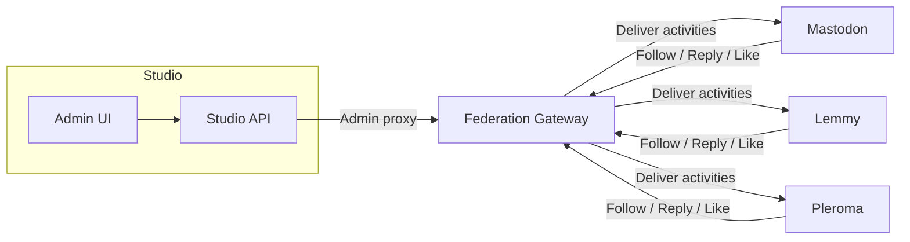

## Overview

roadbeat Studio supports **ActivityPub federation**, allowing every organization to act as a publisher on the Fediverse. When federation is enabled, your organization gets a unique handle (e.g. `@my-newsroom@studio.roadbeat.net`) that remote users on Mastodon, Lemmy, Pleroma, and other ActivityPub-compatible servers can follow.

Published content is automatically delivered to all remote followers as standard ActivityPub `Create` activities. Inbound interactions — follows, replies, likes, boosts, blocks, and flags — are received, processed, and surfaced in the Studio admin UI.

<Callout kind="info">
  Federation requires a running **Federation Gateway** service. If the gateway is not configured, the Federation tab shows a configuration hint instead. See [Configuration](/deployment/configuration) for the required environment variables.
</Callout>

## Prerequisites

Before using federation, ensure:

- The **Federation Gateway** service is deployed and reachable from the Studio API
- The Studio API has the following environment variables set:

| Variable | Description |
|----------|-------------|
| `FEDERATION_GATEWAY_URL` | Base URL of the Federation Gateway (e.g. `https://federation.roadbeat.net`) |
| `FED_ADMIN_TOKEN` | Shared secret token for authenticated communication with the gateway |

## Enabling Federation

Federation is managed per organization from the **Platform Admin** → **Organization Detail** → **Federation** tab.

<Steps>
  <Step title="Open the Organization Detail page" icon="building">
    Navigate to **Platform Admin** → **Manage Organizations** and click the organization you want to federate.
  </Step>
  <Step title="Go to the Federation tab" icon="globe">
    Click the **Federation** tab in the organization detail page. If the gateway is configured correctly, you will see either a provisioning prompt or the federation dashboard.
  </Step>
  <Step title="Provision the publisher actor" icon="user-plus">
    If no actor exists yet, click **Enable federation for this organization**. This creates a publisher identity on the Federation Gateway. The actor's handle is derived from the organization's slug and **cannot be changed later**.
  </Step>
  <Step title="Enable outbound federation" icon="send">
    Once provisioned, toggle **Outbound federation** to start delivering new posts to remote followers.
  </Step>
</Steps>

<Callout kind="alert">
  The actor handle is permanently tied to the organization slug. Choose the slug carefully before provisioning — renaming is not supported by the ActivityPub protocol.
</Callout>

## Federation Dashboard

Once provisioned, the Federation tab displays six sub-tabs:

<Columns cols={3}>
  <Card title="Identity" icon="fingerprint" href="#identity">
    Fediverse handle, IRI, toggle, and delivery counters.
  </Card>
  <Card title="Followers" icon="users" href="#followers">
    Paginated follower list with accept/reject actions.
  </Card>
  <Card title="Discussion" icon="message-circle" href="#discussion">
    Inbound replies with moderation workflow.
  </Card>
  <Card title="Reactions" icon="heart" href="#reactions">
    Like and boost analytics (Studio-only, never on consumer cards).
  </Card>
  <Card title="Moderation" icon="shield" href="#moderation">
    Block and flag events with resolve/dismiss actions.
  </Card>
  <Card title="Policy" icon="settings" href="#policy">
    Follow and reply acceptance policies.
  </Card>
</Columns>

## Identity

The Identity sub-tab shows the core federation state:

- **Fediverse handle** — the `@slug@host` handle that remote users search for
- **Actor IRI** — the full ActivityPub actor URL
- **Outbound federation toggle** — enables or disables delivery of new posts to followers
- **Counters** — followers, following, pending deliveries, and failed deliveries
- **Identity metadata** — host, local ID, provisioned date, last updated

<Callout kind="tip">
  Use the **Copy handle** button to quickly share the organization's Fediverse address with remote users.
</Callout>

## Followers

The Followers sub-tab lists all remote actors that have sent a `Follow` activity to this organization.

### Status Filters

| Filter | Description |
|--------|-------------|
| **All** | Show all followers regardless of status |
| **Accepted** | Followers whose follow request has been accepted |
| **Pending** | Followers awaiting manual approval (when follow policy is `manual_approve`) |

### Actions

- **Accept** — approve a pending follow request; the remote server receives an `Accept` activity
- **Reject / Remove** — reject a pending request or remove an existing follower; the remote server receives a `Reject` activity

## Discussion

The Discussion sub-tab surfaces inbound replies from remote users. When someone on Mastodon replies to one of your federated posts, the reply appears here.

### Status Tabs

| Tab | Description |
|-----|-------------|
| **Pending** | Replies awaiting review (when reply policy is `manual_approve`) |
| **Approved** | Replies that have been approved and are visible |
| **Rejected** | Replies that were rejected by a moderator |
| **Dropped** | Replies that were automatically dropped by policy |

### Moderation Actions

- **Approve** — make the reply visible; marks it as reviewed
- **Reject** — hide the reply with an optional reason; marks it as reviewed

<Callout kind="info">
  Reply HTML is sanitised server-side using a strict allowlist before being stored. The Discussion panel renders the sanitised HTML safely.
</Callout>

## Reactions

The Reactions sub-tab provides analytics on inbound **Like** and **Announce** (boost) activities.

### Analytics View

- **Totals** — aggregate counts of likes and boosts across all federated content
- **Top Objects** — table showing which content items received the most reactions
- **Activity Stream** — paginated list of individual reaction events with kind filter (like / announce / all)

<Callout kind="alert">
  Reaction counts are displayed **only in the Studio admin UI** for editorial analytics. They are never exposed on consumer-facing cards or public APIs. This is a deliberate design decision to avoid incentivising engagement metrics on the consumer side.
</Callout>

### Undo Support

When a remote user undoes a like or boost, the reaction is marked with an `undoneAt` timestamp. Undone reactions are excluded from totals by default but can be included via the activity stream filter.

## Moderation

The Moderation sub-tab handles inbound **Block** and **Flag** activities from remote servers.

### Event Types

| Kind | Description |
|------|-------------|
| **Block** | A remote server or user has blocked your actor. Side effect: the blocking actor is automatically removed from your follower list. |
| **Flag** | A remote user has reported content from your organization. Includes the target IRIs and an optional reason. |

### Status Filters

| Status | Description |
|--------|-------------|
| **Open** | Unresolved events requiring attention |
| **Resolved** | Events that have been investigated and resolved |
| **Dismissed** | Events that have been dismissed (e.g. false positives) |

### Actions

- **Resolve** — mark the event as resolved with an optional note
- **Dismiss** — dismiss the event with an optional note

Events are colour-coded: blocks in red, flags in amber, for quick visual triage.

## Policy

The Policy sub-tab lets you configure how the organization handles inbound interactions.

### Follow Policy

| Policy | Behaviour |
|--------|-----------|
| **Auto-accept** | All incoming follow requests are accepted immediately (default) |
| **Manual approve** | Follow requests land in the Pending queue for manual review |

### Reply Policy

| Policy | Behaviour |
|--------|-----------|
| **Auto-approve** | All incoming replies are approved and visible immediately |
| **Manual approve** | Replies land in the Pending queue for manual review (default) |
| **Drop** | All incoming replies are silently dropped |

<Callout kind="tip">
  For public-facing newsrooms, start with **auto-accept** follows and **manual approve** replies. This maximises reach while keeping editorial control over discussion content.
</Callout>

Changes take effect immediately. The panel shows a dirty-state indicator when unsaved changes exist, with **Save** and **Reset** buttons.

## Content Type Mapping (ActivityPub Tab)

Each content type has a dedicated **ActivityPub mapping** that defines how its fields are represented as ActivityStreams 2.0 objects. You can view this mapping in the Content Type Builder.

<Steps>
  <Step title="Open the Content Type Builder" icon="file-text">
    Navigate to **Content Types** in the sidebar, then click on any content type to open the builder.
  </Step>
  <Step title="Click the ActivityPub tab" icon="globe">
    If a mapping exists for this content type, an **ActivityPub** tab appears in the tab bar (indigo-themed). Click it to view the federation mapping.
  </Step>
  <Step title="Review the mapping" icon="eye">
    The read-only JSON viewer shows the AS2 type, field mappings, transforms, audience defaults, and compatible Fediverse clients.
  </Step>
</Steps>

<Callout kind="info">
  The ActivityPub tab only appears when the Schema Registry has a mapping file for the content type. All 50 standard content types include mappings. Custom content types will show the tab once a mapping is added to the schemas repository.
</Callout>

The mapping controls:
- **Which AS2 type** is used (Article, Event, Note, Video, Audio, Image, Place, etc.)
- **How fields translate** — e.g. `$.title` → `name` with `lang_map` transform
- **Audience defaults** — public vs. followers-only
- **Federation default** — whether new content is federated automatically

For full details on the mapping format, see the [Schema Registry: ActivityPub Mappings](https://docs.roadbeat.net/schema-registry/activitypub-mappings) documentation.

## Outbound Publishing

When outbound federation is enabled and a content item is published with the **Share on Fediverse** toggle active, the following pipeline executes:

<Steps>
  <Step title="Content published" icon="edit">
    The content item's status changes to **Published** in Studio.
  </Step>
  <Step title="NATS event" icon="zap">
    A `content.published` event is emitted on the NATS message bus.
  </Step>
  <Step title="AS2 mapping" icon="code">
    The Federation Gateway's `ApObjectMapperService` converts the content into an ActivityStreams 2.0 `Article` (or appropriate type) with `roadbeat:` extensions.
  </Step>
  <Step title="Outbox + delivery" icon="send">
    The activity is written to the outbox and delivered to all follower inboxes via BullMQ with exponential backoff retry.
  </Step>
</Steps>

Content updates and deletions are also federated as `Update` and `Delete` activities respectively.

## Security

Federation uses multiple layers of security:

- **HTTP Signatures** — all outbound requests are signed using Cavage draft-12 HTTP signatures; all inbound requests are verified
- **Key storage** — actor private keys are encrypted at rest using AES-256-GCM, with optional HashiCorp Vault Transit backend
- **Replay protection** — a Redis-backed replay cache rejects duplicate activity deliveries
- **HTML sanitisation** — inbound reply content is sanitised using a strict HTML allowlist before storage
- **Rate limiting** — the gateway enforces per-actor rate limits on inbound activities

<Callout kind="info">
  For full details on the Federation Gateway's security architecture, see the [Federation Gateway documentation](https://docs.roadbeat.net/federation-gateway).
</Callout>

## API Endpoints

All federation endpoints are proxied through the Studio Management API under the platform namespace. They require super admin authentication.

### Publisher Lifecycle

| Method | Path | Description |
|--------|------|-------------|
| `GET` | `/platform/organizations/:orgId/federation` | Get federation status and publisher state |
| `POST` | `/platform/organizations/:orgId/federation` | Provision a publisher actor |
| `PUT` | `/platform/organizations/:orgId/federation` | Update publisher profile or toggle |

### Followers

| Method | Path | Description |
|--------|------|-------------|
| `GET` | `/platform/organizations/:orgId/federation/followers` | List followers (paginated, filterable) |
| `POST` | `/platform/organizations/:orgId/federation/followers/:id/accept` | Accept a pending follower |
| `POST` | `/platform/organizations/:orgId/federation/followers/:id/reject` | Reject or remove a follower |

### Discussion

| Method | Path | Description |
|--------|------|-------------|
| `GET` | `/platform/organizations/:orgId/federation/replies` | List inbound replies (paginated, filterable) |
| `POST` | `/platform/organizations/:orgId/federation/replies/:id/approve` | Approve a reply |
| `POST` | `/platform/organizations/:orgId/federation/replies/:id/reject` | Reject a reply |

### Reactions

| Method | Path | Description |
|--------|------|-------------|
| `GET` | `/platform/organizations/:orgId/federation/reactions/analytics` | Get reaction totals and per-object breakdown |
| `GET` | `/platform/organizations/:orgId/federation/reactions` | List individual reactions (paginated) |

### Moderation

| Method | Path | Description |
|--------|------|-------------|
| `GET` | `/platform/organizations/:orgId/federation/moderation` | List moderation events (paginated, filterable) |
| `POST` | `/platform/organizations/:orgId/federation/moderation/:id/resolve` | Resolve an event |
| `POST` | `/platform/organizations/:orgId/federation/moderation/:id/dismiss` | Dismiss an event |

### Policy

| Method | Path | Description |
|--------|------|-------------|
| `PATCH` | `/platform/organizations/:orgId/federation/policy` | Update follow and/or reply policy |
