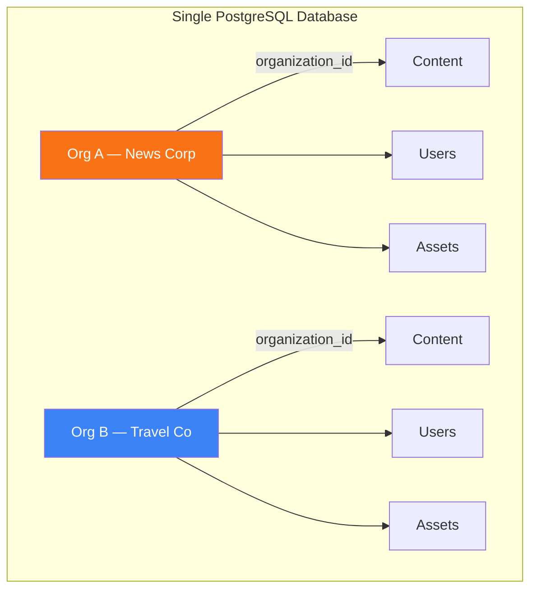

## Overview

roadbeat Studio is a **multi-tenant** headless CMS. Multiple organizations share the same database and application instance, but every piece of data — content, assets, users, content types, webhooks, API keys — is scoped to a single organization. No tenant can detect, access, or affect another tenant's data.

<Callout kind="info">
  Multi-tenancy is a core part of the CE (Community Edition). No Pro license is required.
</Callout>

## Tenant Isolation Model

Studio uses a **shared database, shared schema** model with `organization_id` as the tenant discriminator on every table.



### Key Principles

- **Every query includes `organizationId`** — Prisma `where` clauses always filter by organization
- **Composite primary keys** — `content_types` uses `(organization_id, id)` so different orgs can have the same content type IDs
- **Org-scoped caching** — all cache keys include the organization ID to prevent cross-org cache poisoning
- **Org-scoped search** — MeiliSearch indexes include `organizationId` as a filterable attribute; search results, reindexing, and stats are all per-org
- **Org-scoped rate limiting** — the throttler uses `org:{orgId}:{ip}` as the rate limit key, preventing one org from exhausting another's budget
- **Org-scoped asset storage** — uploaded files are stored under `{orgSlug}/{year}/{month}/` paths with an ownership guard on the `/uploads` endpoint

## Organizations

Each organization has:

| Field | Description |
|-------|-------------|
| **Name** | Display name |
| **Slug** | URL-safe identifier (used in asset paths, default canonical URLs) |
| **Plan** | `free`, `starter`, `professional`, `enterprise` |
| **Max Users** | Per-org user limit |
| **Max Storage GB** | Per-org storage quota |
| **Settings** | JSON object for org-specific configuration (e.g., `canonicalUrlBase`, custom limits) |

### Per-Org Configuration

Organization settings are stored in the `settings` JSON column. Currently supported settings:

```json
{
  "canonicalUrlBase": "https://www.example.com",
  "limits": {
    "max_webhooks": 20,
    "max_api_keys": 10
  }
}
```

<Callout kind="tip">
  `canonicalUrlBase` controls the base URL used when generating canonical URLs for published content. If not set, Studio falls back to the `CANONICAL_URL_BASE` environment variable, then to `https://{orgSlug}.roadbeat.app`.
</Callout>

## Roles and Access Levels

Studio has two layers of access control:

<Tabs>
  <Tab title="Organization Roles" icon="users">
    Standard roles within an organization:

    | Role | Permissions |
    |------|------------|
    | **Admin** | Full access — users, settings, content, publishing, search reindex |
    | **Editor** | Create, edit, publish content and manage assets |
    | **Viewer** | Read-only access to content and assets |

    All organization-level operations are scoped to the user's `organizationId` from the JWT token.
  </Tab>
  <Tab title="Super Admin (Platform)" icon="shield">
    Super admins have cross-org access for platform administration:

    | Capability | Description |
    |-----------|-------------|
    | **List all organizations** | Search, filter, paginate across all orgs |
    | **Create organizations** | Provision new tenants with plan, limits, and initial admin |
    | **Manage org settings** | Update plans, user limits, storage quotas |
    | **Deactivate organizations** | Soft-delete with API key revocation |
    | **Grant/revoke super admin** | Promote or demote platform administrators |
    | **View platform statistics** | Cross-org KPIs, user counts, storage usage |

    Super admin status is stored in the `platform_admins` table, separate from the organization role.
  </Tab>
</Tabs>

## Platform Administration

The Platform Admin dashboard is available to super admins at `/platform/*` in the Angular frontend.

### Features

<Columns cols={2}>
  <Card title="Organization Management" icon="building" href="/guides/multi-tenancy#organizations">
    Create, search, filter, and manage all organizations. View per-org users, stats, and settings.
  </Card>
  <Card title="Platform Statistics" icon="bar-chart-3" href="/guides/multi-tenancy#platform-administration">
    KPI cards for total orgs, users, content, and storage. Orgs-by-plan chart. Recent org activity.
  </Card>
</Columns>

### API Endpoints

All platform endpoints require super admin authentication and are prefixed with `/api/v1/platform/`:

| Method | Path | Description |
|--------|------|-------------|
| `GET` | `/organizations` | List orgs with search, filter, pagination |
| `POST` | `/organizations` | Create a new organization with initial admin |
| `GET` | `/organizations/:id` | Get org details with stats |
| `PUT` | `/organizations/:id` | Update org settings, plan, limits |
| `DELETE` | `/organizations/:id` | Deactivate an org (soft disable) |
| `GET` | `/organizations/:id/users` | List users of an organization |
| `POST` | `/organizations/:id/owner` | Set the owner of an organization |
| `POST` | `/organizations/:id/switch` | Switch super admin context to this org |
| `GET` | `/organizations/:orgId/content-types` | List content types enabled for an org |
| `POST` | `/organizations/:orgId/content-types/copy` | Copy a content type between orgs |
| `DELETE` | `/organizations/:orgId/content-types/:id` | Disable a content type for an org |
| `GET` | `/stats` | Platform-wide statistics |
| `GET` | `/admins` | List super admins |
| `POST` | `/admins` | Grant super admin to a user |
| `DELETE` | `/admins/:userId` | Revoke super admin from a user |

<Callout kind="tip">
  For a full walkthrough of the Platform Admin dashboard UI, see the [Platform Administration](/guides/platform-administration) guide.
</Callout>

## Data Isolation Details

### Content Types — Composite Primary Key

Content types use a composite primary key `(organization_id, id)`. This means:

- Org A and Org B can both have a content type with ID `news`
- Foreign keys from `content` and `content_type_layouts` reference the composite key
- All Prisma queries use `organizationId_id` for `findUnique`, `upsert`, and `delete`

### Search Index Isolation

MeiliSearch indexes are shared but filtered:

- **Search**: all queries include `organizationId = "{orgId}"` filter
- **Reindex**: `reindexForOrg(orgId)` clears only the org's documents via filter-based delete, then re-indexes from the org's DB records
- **Stats**: `getIndexStatsForOrg(orgId)` returns per-org document counts via filtered search

### Asset Storage Isolation

- Files are stored under `{orgSlug}/{year}/{month}/{randomHash}{ext}`
- The `/uploads` endpoint has a guard middleware that checks the JWT org against the path's org directory
- Authenticated users can only access their own org's assets
- Super admins can access any org's assets
- Unauthenticated requests are allowed through (asset URLs are semi-public with random hash filenames)

### Cache Key Isolation

All org-scoped cache keys include the organization ID:

```
content-types:{organizationId}:summary
content-types:{organizationId}:{contentTypeId}
content:{organizationId}:facets
```

### Rate Limiting

The `OrgThrottlerGuard` generates throttle keys as `org:{orgId}:{ip}` for authenticated requests. This ensures per-org rate limiting — one organization's traffic cannot exhaust another's rate limit budget.

## Feature Gates & Limits

Limits are resolved with three-tier priority:

<Steps>
  <Step title="Organization Override" icon="building">
    Per-org limits from `organizations.maxUsers`, `organizations.maxStorageGb`, and `organizations.settings.limits`.
  </Step>
  <Step title="License Limit" icon="key">
    License-level limits from the Pro license JWT token (if present).
  </Step>
  <Step title="CE Default" icon="shield">
    Hard-coded Community Edition defaults (e.g., 3 users, 5 GB storage, 2 API keys).
  </Step>
</Steps>

The `OrgLimitsLoaderService` loads per-org overrides from the database at startup and refreshes on `organization.updated` events.

## Pro Plugin Isolation

Pro plugins follow the same multi-tenancy principles:

- **pro-realtime**: WebSocket rooms include org prefix (`org:{orgId}`, `content:{orgId}:{contentId}`). All broadcasts scoped to org rooms. REST admin endpoints return per-org data only.
- **pro-scheduling**: `pro_scheduled_actions` table includes `organization_id`. All scheduling queries are org-scoped.
- **pro-import**: `pro_imported_content` table includes `organization_id` for defense-in-depth.
- **Event handlers**: All `@OnEvent` listeners verify `organizationId` is present before broadcasting.

## Health & Security Endpoints

| Endpoint | Access | Description |
|----------|--------|-------------|
| `GET /health` | Public | Basic health check (DB, Redis, MeiliSearch status). No server info leaked. |
| `GET /health/queues` | Admin only | Queue statistics. Requires JWT + admin role. |
| `GET /api/v1/search/stats` | Admin only | Per-org search index document counts. |
